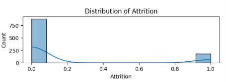

# Proyek Akhir: Solusi untuk Tantangan Perusahaan Edutech

## Pemahaman Bisnis  
Jaya Jaya Maju adalah perusahaan multinasional yang berdiri sejak tahun 2000 dengan lebih dari 1000 karyawan yang tersebar di berbagai wilayah. Walaupun perusahaan ini sudah cukup besar dan mapan, mereka masih menghadapi masalah serius dalam pengelolaan sumber daya manusia. Salah satu isu utama adalah tingginya tingkat **attrition** atau perputaran karyawan yang mencapai lebih dari 10%. Hal ini menjadi indikator adanya kesulitan dalam mempertahankan karyawan, yang dapat berdampak negatif pada produktivitas, biaya rekrutmen, serta kelangsungan operasional perusahaan.

## Permasalahan Utama  
- Berapa besar tingkat attrition yang terjadi di perusahaan?  
- Faktor apa saja yang mempengaruhi keputusan karyawan untuk keluar dari perusahaan?  
- Apakah tingkat attrition berbeda di antara berbagai peran atau departemen?  
- Bagaimana peran lembur (overtime) terhadap keputusan karyawan untuk mengundurkan diri?

## Lingkup Proyek  
- **Analisis Data:** Memanfaatkan data karyawan untuk mengidentifikasi faktor-faktor utama yang berkontribusi pada attrition.  
- **Visualisasi dan Pelaporan:** Membuat dashboard interaktif bagi manajemen HR untuk memantau dan menganalisis faktor-faktor tersebut secara visual.  
- **Rekomendasi dan Tindakan:** Memberikan usulan solusi berdasarkan hasil analisis untuk menurunkan tingkat attrition dan meningkatkan kepuasan karyawan.

## Persiapan dan Setup

### Dataset  
Data yang digunakan berasal dari perusahaan Jaya Jaya Maju.

### Membuat Environment Conda  
```bash
conda create --name proyek-hr python=3.9.15
````

### Instalasi Dependencies

```bash
pip install -r requirements.txt
```

### Menyiapkan Metabase

```bash
docker pull metabase/metabase:v0.46.4
docker run -p 3000:3000 --name metabase metabase/metabase
```

Akses Metabase di [http://localhost:3000/setup](http://localhost:3000/setup) untuk konfigurasi awal.

### Menyiapkan Database Supabase

* Daftar dan login di [https://supabase.com/dashboard/sign-in](https://supabase.com/dashboard/sign-in)
* Buat project baru
* Salin URI database dari pengaturan project
* Upload dataset menggunakan SQLAlchemy:

```python
from sqlalchemy import create_engine

DATABASE_URL = "YOUR_DATABASE_URL"

engine = create_engine(DATABASE_URL)
df.to_sql('orders', engine)

```
**Username:** [root@mail.com](mailto:root@mail.com)
**Password:** root123
``

## Dashboard Bisnis

Dashboard ini bertujuan memberikan insight menyeluruh bagi tim HR mengenai faktor-faktor yang mempengaruhi karyawan dalam mengambil keputusan keluar dari perusahaan. Dengan menggunakan dashboard ini, tim HR dapat:

* Mengenali departemen atau posisi yang memiliki tingkat attrition tinggi
* Menggali pengaruh faktor seperti lembur, kepuasan kerja, dan demografi terhadap attrition
* Melakukan langkah-langkah strategis untuk meningkatkan retensi dan menekan biaya pergantian karyawan
  


## Kesimpulan

 1.  **Berapa besar tingkat attrition di perusahaan?**
Tingkat attrition di perusahaan ini adalah sekitar 17%, berdasarkan data bahwa sekitar 1 dari 6 karyawan keluar. Angka ini diperoleh dari proporsi jumlah karyawan yang keluar dibanding total karyawan, dan didukung oleh distribusi pada grafik. Hal ini menunjukkan bahwa perusahaan menghadapi tantangan serius dalam mempertahankan karyawan.



 2.  **Faktor apa saja yang berpengaruh?**

* **Lembur:** Karyawan dengan jam lembur tinggi cenderung lebih sering keluar.
* **Status Perkawinan:** Karyawan yang belum menikah (single) memiliki risiko attrition yang lebih tinggi, mungkin karena mobilitas dan keinginan mencari peluang baru.


3.  **Apakah ada variasi berdasarkan departemen atau posisi?**
Ya. Misalnya, posisi Sales Representative dan departemen Sales menunjukkan tingkat attrition yang lebih tinggi dibandingkan yang lain, kemungkinan disebabkan oleh tekanan kerja dan struktur insentif yang ada.
dapat dilihat pada 
* distribusi attrition vs departement
* 


* distribusi attrition vs jobrole


4. **Bagaimana pengaruh lembur terhadap keputusan keluar?**
Lembur berkontribusi signifikan terhadap keputusan karyawan untuk resign, kemungkinan dikarenakan meningkatnya stres dan ketidakseimbangan antara pekerjaan dan kehidupan pribadi.


## Rekomendasi Tindakan

* **Kelola dan kurangi jam lembur:** Evaluasi beban kerja untuk menghindari lembur berlebihan yang dapat merusak keseimbangan hidup dan kerja.
* **Tingkatkan kepuasan dan suasana kerja:** Terapkan program yang mendukung kenyamanan dan keterlibatan karyawan.
* **Fokus retensi di departemen kritis:** Berikan perhatian khusus dan insentif di area dengan attrition tinggi, seperti departemen Sales.
* **Pantau secara berkelanjutan:** Gunakan dashboard untuk mengawasi faktor risiko dan lakukan penyesuaian cepat jika diperlukan.

Dengan langkah-langkah ini, diharapkan tingkat attrition dapat ditekan, retensi karyawan meningkat, dan stabilitas operasional perusahaan menjadi lebih kuat.


